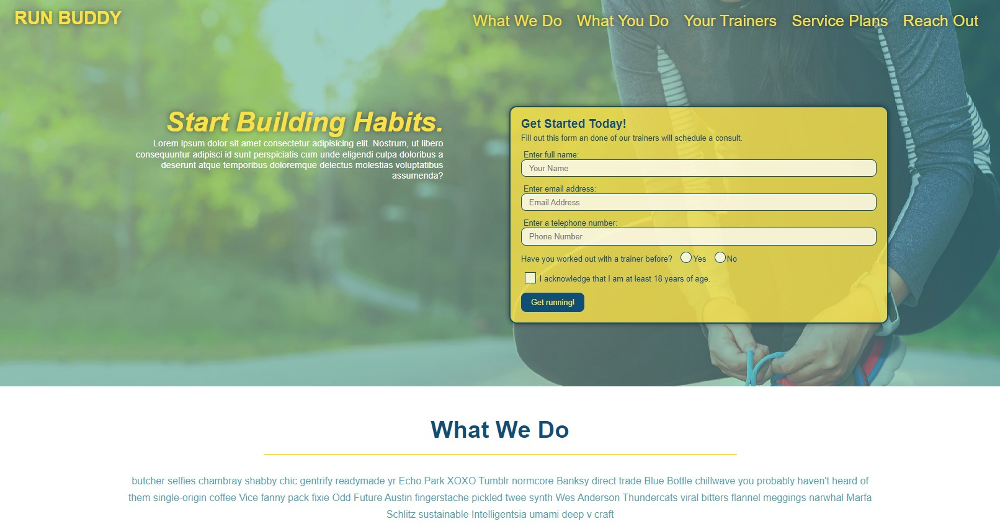

# Run Buddy Website

## Description
An e-commerce type of website that offers fitness training services. Website front-end layout if fully adjustable to all computer and mobile screen sizes. Website built with HTML, CSS, Bootstrap and JQuery.

## Deployed URL
https://malickbax.github.io/run-buddy/

## Screenshot

## Installation
No instllation required. Please open the deployed URL below to see product. 

## Test
No testing required

## Contribution
Made by **Malick Ba**, Software Engineer based in Virginia, USA as part of a George Washington University Coding Bootcamp. 2022

For more projects, please visit my [GitHub page](https://github.com/malickbax)
